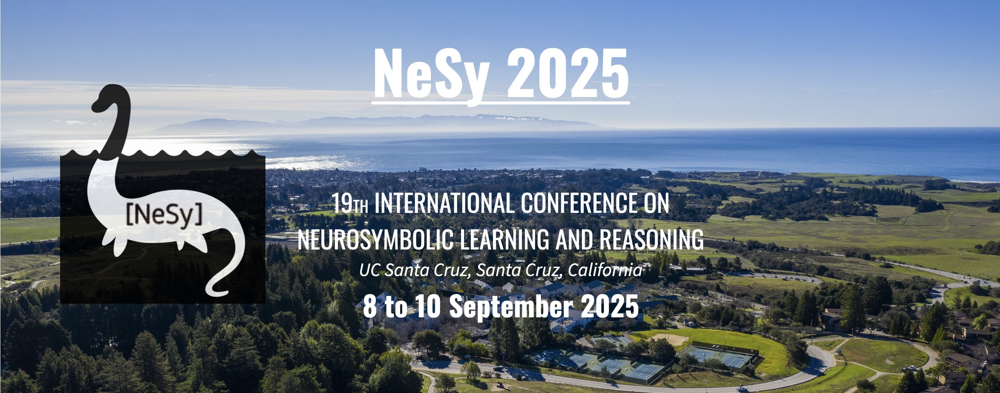

---
# Feel free to add content and custom Front Matter to this file.
# To modify the layout, see https://jekyllrb.com/docs/themes/#overriding-theme-defaults

permalink: /
title: NeSy 2025
fulltitle: 19th Conference on Neurosymbolic Learning and Reasoning (NeSy 2025)
layout: home
---

This year, **NeSy 2025** will be held in **Santa Cruz, California, from September 8th to 10th.** We accept full papers, short papers, and extended abstracts of recently published papers on any topic related to neurosymbolic AI. Please see the [call for papers](/call-for-papers/) for more details.

The NeSy series is the longest standing gathering for the presentation and discussion of cutting-edge research in [neurosymbolic AI](https://people.cs.ksu.edu/~hitzler/nesy/). NeSy is the annual meeting of the [Neurosymbolic Learning and Reasoning Association](https://nesyconf.org), which has organised NeSy since 2005, back then as a workshop.

We are excited to announce our **excellent line-up of keynote speakers**:
- [Guy van den Broeck](https://web.cs.ucla.edu/~guyvdb/), University of California, LA 
- [Thomas Kipf](https://tkipf.github.io/), Google DeepMind
- [Deborah McGuinness](https://faculty.rpi.edu/deborah-mcguinness), Rensselaer Polytechnic Institute

### About the NeSy Conference 
The NeSy conference studies the integration of deep learning and symbolic AI, combining neural network-based statistical machine learning with knowledge representation and reasoning from symbolic approaches. 
Neural networks and statistical machine learning have achieved relevance in industries from healthcare to finance, obtaining state-of-the-art performance at language modelling, speech and image recognition, sensor data and graph analytics. 
While symbolic AI struggles with large unstructured datasets, it offers sound and well-understood formal reasoning and explanations via inspectable knowledge representations. 
These approaches complement each other in their strengths: deep learning excels at raw data processing, but fails at planning and rich deductive reasoning.

Neurosymbolic AI aims to build powerful computational AI models, systems and applications by integrating neural and symbolic learning and reasoning. 
It creates synergies that leverage the strengths of both paradigms while overcoming their complementary weaknesses. 

The NeSy conference series is the premier venue for advancing the theory and practice of neurosymbolic computing. 
Since the first NeSy, as a workshop in 2005, NeSy has fostered an open and collaborative atmosphere, bringing together scientists and practitioners that straddle the line between deep learning and symbolic AI. 
